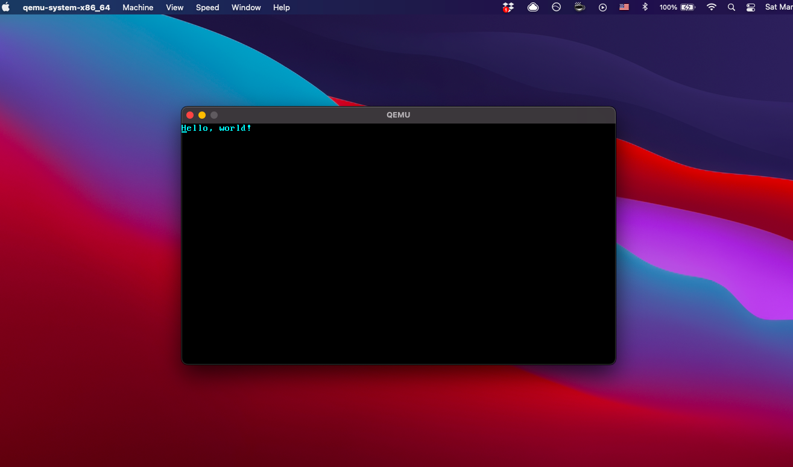

An OS in Rust
=============

Following [this tutorial](https://os.phil-opp.com/).

## Building
Assuming you have a [Rust toolchain](https://www.rust-lang.org/tools/install) installed:

```bash
# In order to create a bootable disk image, we need to link
# the kernel and the bootloader, but only after each is compiled.
# I don't know if more recent versions of Cargo support post-build
# scripts, but this wasn't the case when this tutorial was written,
# so we'll install the `bootimage` tool to handle this process.
$ cargo install bootimage
# The LLVM tools preview component is required by `bootimage`.
$ rustup component add llvm-tools-preview
$ cargo run
```


